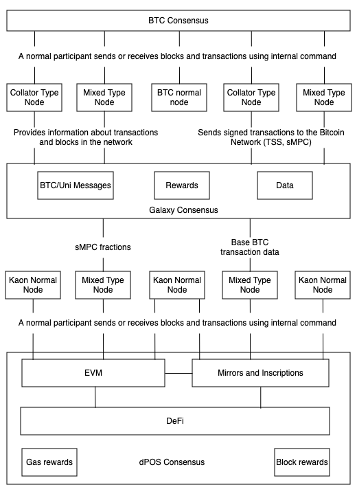

# 1. Introduction

In the ever-evolving world of cryptocurrency, the complexities and challenges associated with trading and managing Bitcoin (BTC) have become increasingly apparent. Unilayer emerges as a revolutionary solution addressing several critical pain points that currently plague the Bitcoin network. This introduction delves into these challenges and how Unilayer's innovative approach aims to resolve them, providing a seamless and secure trading experience for users. Building on this foundation, the Kaon.one project continues these innovations, significantly enhancing decentralized cross-blockchain interactions for asset exchanges.

Kaon.one is a novel blockchain project with the goal to considerably improve decentralized cross-blockchain interactions for asset exchanges. Built on the foundation of the [UniLayer system](https://unilayer.io), the successor Kaon.one system comprises innovative technological innovations to offer a seamless, secure, and efficient system for decentralized applications (dApp). Kaon.one provides cross-blockchain transactions with interoperability capabilities for asset exchanges between different blockchain networks. The core architecture of Kaon.one combines the advantages of Bitcoin's [Unspent Transaction Output](https://coincentral.com/utxo-beginners-explainer/) (UTXO) protocol and the Ethereum Virtual Machine (EVM) models. 

**UTXO Protocol**

To understand the key principles of how Kaon.one performs operations it is important to firstexpand on fundamental principles of how UTXO transactions are carried out versus the Ethereum account model. Briefly, the UTXO protocol is a foundational part of many blockchain systems, including the first usecase of modern blockchain, i.e., Bitcoin. The UTXO protocol denotes the state of a blockchain by tracking unspent transaction outputs that are the remaining portions of a cryptocurency transaction. This unspet transaction output is available as inputs for future transactions.

For carrying out a transaction that involves the UTXO model, a user first selects one or more unspent transaction outputs (UTXOs) in their ownership. Note that the user of, e.g., bitcoin, is not necessarily aware of the background mechanism triggered by a crypto wallet in combination of the decentralised bitcoin blockchain protocol that occurs during a transaction. Thus, the accumulated value of these selected UTXOs must be equal to or greater than the amount a user aims to spend via a crypto payment dApp. Consequently, the user creates the transaction by which the selected input UTXOs are specified. The defined new outputs include the recipient addresses and the amounts to be transferred.

The created UTXO transaction is broadcast to the network that validates the former by checking the signatures and ensuring that the inputs are factually unspent. A valid transaction is consequently propagated through the blockchain protocol and miners include the transaction in a block, which is finally added to the blockchain. At this point, the inputs of the transaction are marked as spent, and the outputs turn into new UTXOs available for the next transactions.

An advantage of the UTXO protocol is the enhanced validation security that is established by explicitly defining the inputs and outputs of respective transactions. Furthermore, the UTXO protocol also established transparency by creating an auditable transaction trail of the asset transfers. Finally, since each respective transaction is independent, the UTXO protocol supports parallel validation. Thus, multiple transactions can be validated and processed simultaneously, which improves scalability.

**Account-Based Model**

[Ethereum](https://www.horizen.io/academy/utxo-vs-account-model/) uses an account model to manage transactions and correspondign states on the blockchain. This account model differs from Bitcoin's UTXO model and supports Ethereum's functionalities such as smart contracts. Two types of accounts exist in the Ethereum account model, namely externally owned accounts (EOAs) and contract accounts. The former are controlled by private keys and can initiate transactions, while the latter are governed by smart contract code that is executed when they receive transactions. Each account has a unique address, which serves as a unique identifier on the blockchain.

In the account-based model, a user initiates a transaction in which the amount of ETH is specified that must be transferred. Additionally delivered are the recipient's account address, and optionally, data to trigger specific contract functions. The sender's private key is used to sign a transaction, which clarifies the authenticity and ensures security. The transaction itself is validated by the nodes after being broadcast to network. The nodes check the signature, also check if the sender has enough ETH to pay the transaction fee, and update the state of both the sender's and recipient's accounts.

The account model also has several advantages. First, this is a fairly simple and efficient model for the execution of smart contracts.  Second, the account model allows for direct state updates and thereby simplifies contract executions and state management. Additionally, the account model supports the concept of gas being a unit to measure the computational operations-execution effort. Gas fees are paid in ETH and incentivce the miners to include transactions in blocks. Gas is also a mechanism that prevents the abuse of computational resources on the Ethereum network.

**Decentralized Finance (DeFi)**

Blockchain technologies are used to create a parallel emerging financial system as an improved decantralized versus versus the traditional legacy financial system. [DeFi](https://aws.amazon.com/blockchain/what-is-defi/) aims to eliminate the need for trusted third-party intermediaries such as banks, brokers, and exchanges. Instead, DeFi provides peer-to-peer (P2P) financial services that are accessible to anyone with an internet connection. Allegorically expressed, while legacy finance takes over the control of the customers' private keys in a centralized business model, DeFi gives the private keys back to the customers into their respective control. 

The remainder of this chapter is structured as follows. In Section 1.1 an overview of the Kaon.one cross-blockchain system is presented as a conceptual architecture. Section 1.2 briefly explain the situation that has resulted in the rebranding of Unilayer to Kaon.one, followed by Section 1.3 that gives the Kaon.one objectives and vision. Finally, Section 1.4 lists briefly the key innovations of the Kaon.one system that the subsequent chapters will expand on in further detail.

## 1.1 Overview of Kaon.one

As stated above, the primary goal of Kaon.one is to considerably improve and extend decentralized cross-blockchain interactions, which enables seamless asset exchanges across diverse blockchain networks. <!-- Thereby, Kaon.one addresses the inherent limitations of existing blockchain solutions by integrating unique technological advancements designed to improve security, efficiency, and scalability. -->
Thus, Kaon.one combines in a specific way the strengths of the UTXO protocol and also of the Ethereum account-based model. This hybrid approach of Kaon.one leverages the UTXO protocol's enhanced security and parallel validation capabilities in combination with the smart contract functionalities of the account-based model.
This hybrid approach features native support for Recursive Length Prefix (RLP) transactions, used widely across dApps including Metamask, facilitating off-chain transaction creation and signing. Briefly, RLP is a serialization scheme used in Ethereum for encoding arbitrarily nested arrays of binary data for the efficient and flexible encoding of transactions, blocks, and other data structures in Ethereum. Consequently, Kaon.one offers a system to support complex decentralized dApps with cross-blockchainchain interaction capabilities.

  

The architecture depicted above, allows nodes to replace traditional [oracles](https://chain.link/education/blockchain-oracles), using the [Galaxy consensus](https://docs.wanchain.org/technology/galaxy-consensus) to verify information across all mixed-type nodes and collaterals from other chains. An oracle in the context of blockchain technology is a service or mechanism that provides external data to smart contracts on the blockchain. Note that the latter typically cannot access data outside of a blockchain they are deployed on. Oracles act as intermediaries that fetch, verify, and supply smart-contract external data, allowing smart contracts to interact with the real world and execute based on data not natively available on the blockchain. 

### 1.1.1 BTC Consensus Layer

Starting from the top of the architecture figure, the top rectangle denotes the BCT consensus layer, which represents the foundational consensus mechanism derived from the Bitcoin blockchain. In the Kaon.one architecture, the BTC Consensus layer leverages these UTXO model benefits of security, parallel processing, and transparency; integrating them with advanced features like native RLP transaction support and off-chain transaction creation and signing. As a Bitcoin side-chain, Kaon.one uses the same private keys, enabling non-custodial mirroring of BTC onto the Kaon chain. This mirrored BTC maintains a tight link to the original, ensuring it can be unwrapped at any time, providing transparency and traceability

### 1.1.2 Node Types and Connections

Beneath the BTC Consensus layer are five distinct types of nodes, each fulfilling a unique role within the Kaon.one architecture. These nodes are integral to the network's operation, ensuring the sound processing and validation of transactions and blocks. The five types of nodes are:

1. **Collator Type Node** (two instances)
2. **Mixed Type Node** (two instances)
3. **BTC Normal Node**

#### 1.1.2.1 Collator Type Node
Collator Type Nodes are specialized nodes that function as intermediaries between the Bitcoin network and the Kaon.one network. These nodes are responsible for collating transactions and ensuring they are accurately represented in the blockchain. By doing so, they facilitate efficient transaction processing and ensure the integrity of the data being transferred between the networks. In the architecture, there are two instances of Collator Type Nodes, which enhances redundancy and reliability.

#### 1.1.2.2 Mixed Type Node
Mixed Type Nodes have dual functionalities, acting both as collators and validators. These nodes play a pivotal role in processing and forwarding messages from connected chains. Their dual capability allows them to manage cross-chain information effectively through decentralized, consensus-based methods. The inclusion of two instances of Mixed Type Nodes ensures that the network can handle a higher volume of transactions and data, thereby improving overall scalability and performance.

#### 1.1.2.3 BTC Normal Node
The BTC Normal Node operates purely within the Bitcoin network. Its primary function is to participate in standard Bitcoin operations such as validating blocks and processing transactions. Unlike the other nodes, the BTC Normal Node does not interact with the Kaon.one network's unique features, such as the Galaxy consensus. Instead, it ensures that the fundamental Bitcoin network operations are executed efficiently and securely.

These nodes listed above are interconnected with the BTC Consensus layer through lines labeled "Normal participant, sends and receives blocks and transactions using internal commands." This label indicates that these nodes engage in the regular activities of the Bitcoin network, such as:

1. **Block Validation**: Ensuring that new blocks meet all necessary consensus rules and are added to the blockchain correctly.
2. **Transaction Processing**: Validating and propagating transactions across the network, ensuring that they are confirmed and included in new blocks.

### 1.1.3 Galaxy consensus

Next, the Galaxy consensus is a sophisticated consensus mechanism used in blockchain networks to achieve reliable and secure data validation, especially in the context of cross-chain transactions. Thus, this consensus model enhances interoperability and overall network efficiency. Key features of the Galaxy consensus are: cross-blockchain data validation; decentralized verification; integration with delegated proof of stake (dPOS), where validators are selected based on the amount of stake they hold or have been delegated by other stakeholders; threshold signature scheme (TSS) that allows multiple parties to collaboratively generate a signature on a transaction without revealing their individual private keys, thus securing cross-chain transactions. 

The architecture integrates the collator- and mixed type nodes with the Galaxy Consensus layer. Specifically:
- The **Collator Type Nodes** and **Mixed Type Nodes** provide information about transactions and blocks within the network, enhancing the accuracy and efficiency of data processing.
- These nodes also send signed transactions to the Bitcoin Network using Threshold Signature Scheme (TSS) and secure Multi-Party Computation (sMPC) mechanisms, ensuring secure and verified cross-chain interactions.

The **BTC Normal Node**, however, remains isolated from the Galaxy Consensus interactions, focusing solely on maintaining the integrity and operations within the Bitcoin network.

Within the Galaxy Consensus layer, there are three nested components, each serving a distinct purpose: "BTC/Uni Messages," "Rewards," and "Data."

#### 1.1.3.1 BTC/Uni Messages

The "BTC/Uni Messages" component is responsible for handling communication between the Bitcoin network and the Kaon.one network. This involves ensuring that messages and transactions between Bitcoin (BTC) and the Uni (Kaon.one) networks are accurately transmitted and received. It also includes monitoring and logging events from both networks to maintain consistency and synchronization. Additionally, this component uses the Galaxy consensus mechanism to validate messages, ensuring their authenticity and integrity before further processing.

#### 1.1.3.2 Rewards

The "Rewards" component manages the distribution of incentives within the network. It allocates rewards to validators who successfully validate blocks and transactions, allowing them to earn rewards from block validation, transaction fees, and gas fees. Furthermore, it distributes staking rewards to participants who stake their tokens to support validators, thereby enhancing their chances of selection and contributing to network security. The component also ensures that validators participating in cross-chain transactions receive appropriate compensation for their additional efforts and resources.

#### 1.1.3.3 Data

The "Data" component is tasked with handling and managing the critical data required for network operations. It maintains the current state of the blockchain, including account balances, contract states, and transaction histories. This component also stores data related to the consensus process, encompassing validator selections, block proposals, and voting results. Additionally, it manages data related to cross-chain interactions, ensuring that information from external chains is accurately represented and processed within the Kaon.one network.

### 1.1.4 Normal nodes

Below the Galaxy Consensus layer, the architecture features nodes dedicated to the Kaon network, which play an important roles in maintaining and enhancing the network's functionality. Note that due to historical development reasons, the architecture figure above  The nodes involved are:

1. **Kaon Normal Node** (three instances): These nodes are dedicated to performing standard operations within the Kaon blockchain. They handle routine tasks such as processing transactions, validating blocks, and maintaining the integrity of the blockchain ledger. Kaon Normal Nodes ensure that the network operates smoothly and securely, providing a stable backbone for all blockchain activities.

2. **Mixed Type Node** (two instances): These nodes have dual roles, participating in both the Kaon and Bitcoin networks. Mixed Type Nodes are designed to handle cross-chain interactions and facilitate communication between different blockchain environments. They are essential for enabling seamless interoperability and ensuring that transactions and data can flow smoothly between the Uni network and other blockchain systems.

The connections from the Galaxy Consensus layer to the Kaon network nodes are important for the system's integrated operations and cross-chain capabilities:

- **sMPC Fractions**: This connection supports secure multi-party computations (sMPC) within the network. By distributing the computational load across multiple nodes, the sMPC Fractions ensure that sensitive operations, such as transaction signing and data validation, are performed securely and efficiently. This method enhances the overall security of the network by reducing the risk of single points of failure and enabling robust, decentralized processing of critical tasks.

- **Base BTC Transaction Data**: This connection is responsible for facilitating the sharing of essential Bitcoin transaction data across the Kaon network. By providing access to base BTC transaction data, this link ensures that nodes within the Kaon network have the necessary information to process and validate cross-chain transactions involving Bitcoin. This integration is crucial for maintaining transparency, consistency, and trustworthiness in cross-chain operations, allowing the Kain network to leverage Bitcoin's security and reliability.

### 1.1.5 dPoS Consensus Layer

At the bottom of the Kaon architecture is the **dPOS Consensus** layer, which governs the overall consensus mechanism through dPOS. This layer is critical in maintaining the integrity and efficiency of the Kaon.one network. It incorporates several components that work together to facilitate seamless blockchain operations and ensure robust security.

The **EVM** component within this layer is pivotal as it supports the execution of smart contracts and complex dApp functionalities. By integrating Ethereum's capabilities into the UTXO model of Kaon.one, it bridges the gap between different blockchain paradigms, enabling sophisticated programmable transactions and automated processes across the network.

The **Mirrors and Inscriptions** component manages the mirroring of tokens and inscription-based tokens from other chains. This ensures seamless cross-chain asset transfers, allowing tokens to be mirrored onto the Kaon.one chain while maintaining a tight linkage to their original chains. This process enhances interoperability and broadens the range of assets that can be utilized within the Kaon.one ecosystem.

The **DeFi** component acts as the central hub for all decentralized finance activities within the network. Leveraging the unique features of Kaon.one, it facilitates a wide range of financial operations such as lending, borrowing, and trading across blockchains. This component is crucial for enhancing the financial inclusivity and accessibility of blockchain technology.

**Gas Rewards** and **Block Rewards** are integral components within the dPoS Consensus layer that ensure validators and participants are properly incentivized for their contributions. Gas rewards are distributed based on the computational resources used for executing transactions and smart contracts, while block rewards are given for the successful validation and inclusion of new blocks in the blockchain. These rewards mechanisms are essential for maintaining network security and encouraging active participation.

The EVM and Mirrors and Inscriptions components are intricately connected to the DeFi component, indicating their integral roles in supporting decentralized financial applications. These connections highlight how smart contracts and mirrored tokens enhance the functionality and versatility of the DeFi ecosystem within Kaon.one. Additionally, these components are linked to the Kaon network nodes, which indicates their participation in standard blockchain operations, ensuring that all parts of the network work in harmony to achieve efficient and secure transaction processing.

<!-- 
## 1.2 Rebranding from UniLayer to Kaon.one

The project initially known as [UniLayer](https://unilayer.io) has undergone a strategic rebranding to Kaon.one. This rebranding reflects the platform’s evolved vision and enhanced capabilities, positioning it as a leader in decentralized cross-blockchain innovation. The transition underscores a commitment to advancing the blockchain ecosystem with robust and user-friendly solutions. This commitment is evident in its ongoing efforts to develop and integrate advanced features that enhance the user experience and provide seamless, secure, and efficient cross-blockchain transactions. The rebranding aligns with the platform’s goal of fostering a more interconnected and interoperable blockchain ecosystem, where users can easily and securely exchange assets across different blockchain networks. Rebranding to Kaon.one also involves strengthening the platform’s brand identity and fostering deeper engagement with its community. A strong and recognizable brand is crucial for building trust and credibility in the blockchain space. -->

## 1.2 Objectives and Vision

Kaon.one aims to develop a decentralized environment in which diverse blockchain networks interact seamlessly. Thus, the system's objectives are multifaceted, focusing on improved transaction efficiency, cutting considerably operational costs, while supporting the development of innovative third-party dApps. With improved transaction efficiency, Kaon.one wants to realise faster and more reliable value exchanges across different blockchain networks. Another critical objective is the reduction of costs, achieved by an underlying protocol optimization and leveraging state-of-the-art technologies to minimize the cross-chain transaction fees.

Furthermore, Kaon.one emphasis and encourages the development and support of dApps to improve a broad spectrum of industries ranging from finance to supply chain management, and so on. The system provides developers with the tools and resources to create, deploy, and manage such dAppsto foster innovation. Kaon.one works towards a future in which blockchain technology is accessible and beneficial to all users, irrespectively of their technical capabilities. This vision comprises enabling digital interactions across different chains that are inherently secure, transparent, and trustless. Thus, Kaon.one wants to foster an inclusive environment in which users may seamlessly interact with several blockchain networks.

The long-term Kaon.one vision reaches beyond merely technical improvements and seeks to democratize blockchain technology access. This vision ensures the participation of users from all backgrounds in the targeted decentralized economy. By prioritizing user experience and security, Kaon.one aims to build an ecosystem that, on the one hand, meets the current needs of the blockchain community, and on the other hand, also anticipates and addresses future challenges. Through the commitment to interoperability, scalability, and user empowerment, Kaon.one aims to be leading in blockchain innovation, improving considerably the adoption and integration of decentralized technologies in a broad spectrum of industries on a global scale.

## 1.3 Innovations of Kaon.one

Kaon.one introduces several pioneering innovations that differentiate this system apart from other existing blockchain solutions that will be expanded upon in the respective subsequent chapters:

1. mirrorBTC: This feature ensures mirrored token interactions are genuinely connected to the original BTC, addressing trust and security issues associated with wrapped BTC.

2. UTXO-EVM Combination: Allows seamless interaction with inscriptions, ordinals, BRC20, and runes from smart contracts, bridging the gap between UTXO and EVM models.

3. RLP Transaction Support: Enables seamless integration with Metamask and other Ethereum-based tools, a unique feature among UTXO chains.

4. 1e-18 Denomination: Offers 10 times less expensive gas fees and complete EVM support, surpassing the traditional 1e-8 BTC denomination.

5. RPC Ethereum Full Support: UTXO transactions are parsed as standard Ethereum transactions, ensuring compatibility with Ethereum tools like Blockscout.

6. Cross-Contracts: Facilitates smart contract interactions across different chains, simplifying the creation of cross-chain NFTs, stablecoins, and dApps.

7. Observers: Introduces a subscription model for dApps to back-spread specific events from other chains, enhancing user experience and interaction complexity.

8. Control over Pools by the Chain: Ensures liquidity pools for swaps are managed by the chain, enhancing security and trust.

9. Merge of Nodes: Combines nodes from different chains to operate as a single entity, eliminating the need for oracles in cross-chain interactions.

10. Same Private Keys as in BTC: Allows users to sign transactions in both chains with the same wallet, leveraging account abstraction with BTC.

These innovations collectively position Kaon.one as a versatile and forward-thinking dApp capable of addressing current blockchain challenges and future developments.
